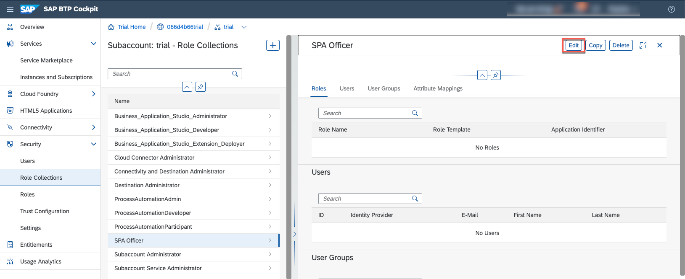
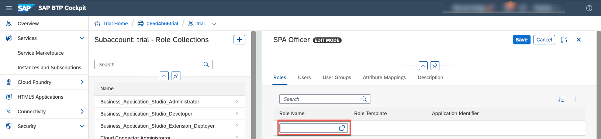

## Table of Contents
 - [Overview](#overview)
 - [Get a Free Account on SAP BTP](#AccountBTP)
 - [Subscribe to SAP Process Automation](#SPA)
 - [Role Collection Creation](#Role)
 - [Role Collection Assignment](#RoleCollection)
 - [Summary](#summary)

### Overview 

In this exercise, you will learn:
- How to start create SAP Process Automation Trial account

## 1. Get a Free Account on SAP BTP 

1. Complete [Get a Free Account on SAP BTP Trial](https://developers.sap.com/tutorials/hcp-create-trial-account.html) tutorial.

## 2. Subscribe to SAP Process Automation  

1.	Select **Service Marketplace**. In the Search field type **SAP Process Automation** and select the tile.

 

> In case the SAP Process Automation cannot be found, go to the Step XX.

2. Choose **Create** button.

 

3. In the New Instance or Subscription window, choose the **free** Plan and select **Create** button.

 

4. Select **View Subscription** button.

 

5. Check if its processed and created successfully.

 

## 3. Role Collection Creation  

1. Under **Security** Menu choose **Role Collections**.

 

2. Select **(+)** to create a new Role Collection.

 

3. Priya/ Archana what kind of roles do we need to assign for TechEd?? NAme? SPA Office?

 

4. Select the created Role collection.

 

5. Choose **Edit** button

 

6. Select **Role Name**

 

7. Search for **SPA Officer** not possible do we have to choose the one with iRPA?

## 4. Role Collection Assignment  

 1. Go back to the trail subaccount

## 5. SAP Process Automation Factory access

## Summary  

Now that you have ...
Continue to - [Exercise 2](../ex2/README.md)
