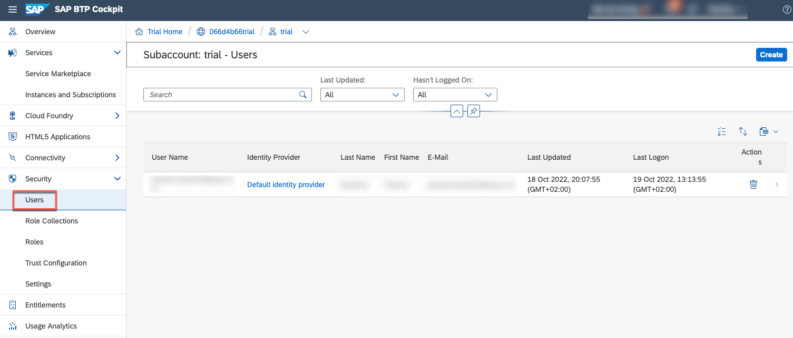
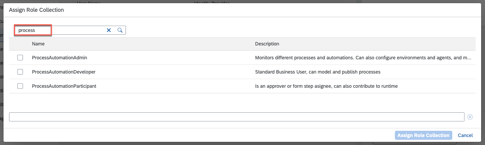
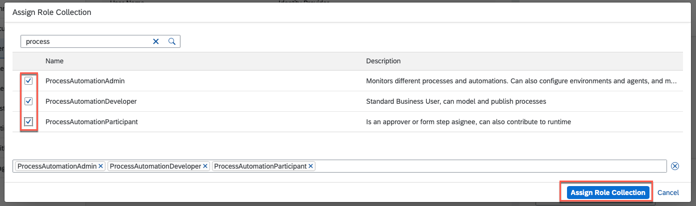
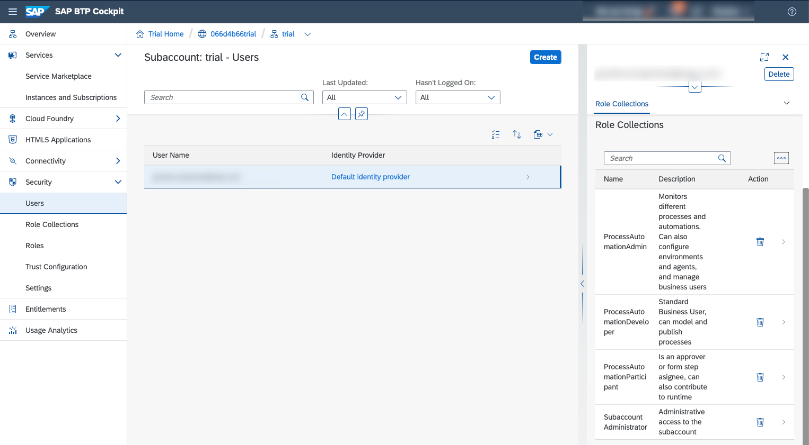

## Table of Contents
 - [Overview](#overview)
 - [Get a Free Account on SAP BTP](#AccountBTP)
 - [Subscribe to SAP Process Automation](#SPA)
 - [Assign Roles](#Roles)
 - [Summary](#summary)

### Overview 

In this exercise, you will learn:
- How to subscribe to  SAP Process Automation in SAP Trial account

## 1. Create an Account on SAP BTP 

1. Complete [Get a Free Account on SAP BTP Trial](https://developers.sap.com/tutorials/hcp-create-trial-account.html) tutorial.

## 2. Subscribe to SAP Process Automation  

1.	Select **Service Marketplace**. In the Search field type **SAP Process Automation** and select the tile.

 

2. Choose **Create** button.

 

3. In the New Instance or Subscription window, choose the **free** Plan and select **Create** button.

 

4. Select **View Subscription** button.

 

5. Check if its processed and created successfully.

 

## 3. Assign Roles  

1. To get access, assign the role collection to your user.
- Go to the **Users**,
- Pick your user,
- Next to Role Collections, choose **3 dots**,
- Select Assign **Role Collection**.

 

2. In the Assign Role Collection window, under search field type **process** to find Process Automation Roles.

 

3. In the Assign Role Collection window,
- Select 3 roles: ProcessAutomationAdmin, ProcessAutomationDeveloper, ProcessAutomationParticipant,
- Select **Assign Role Collection** button.

 

4. After assigning roles, your **Roles Collections** section should look like this:

 

5. Launch SAP Process Automation Tenant.

 
## Summary  

You have successfully subscribed to SAP Process Automation and start with your exercises.
