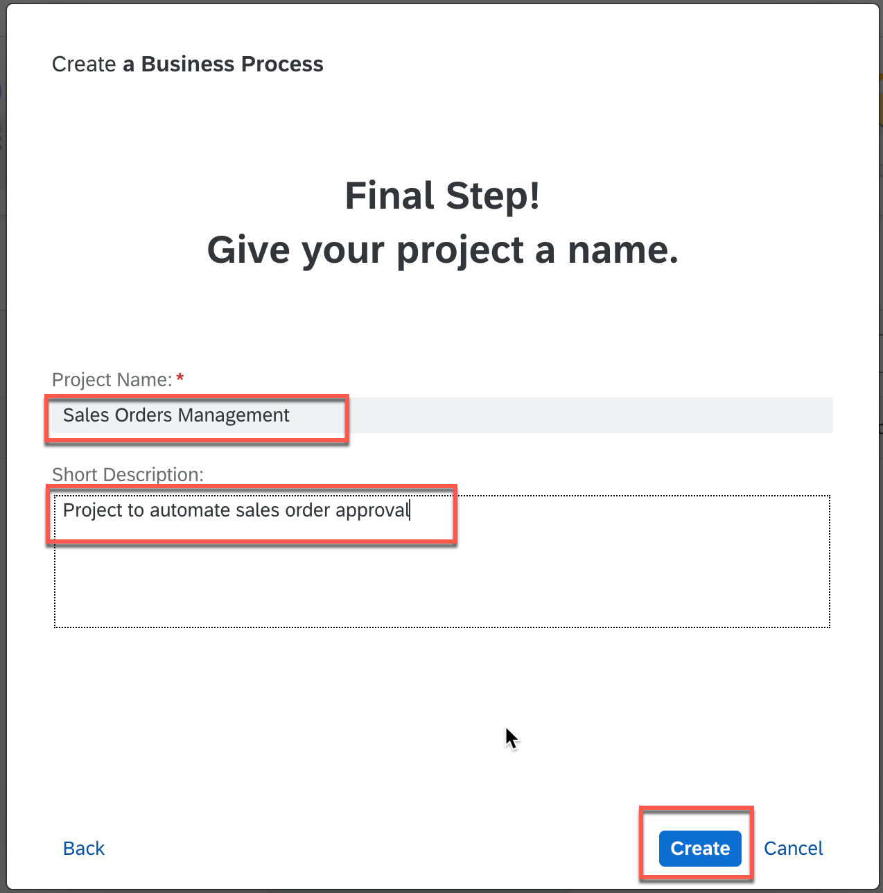
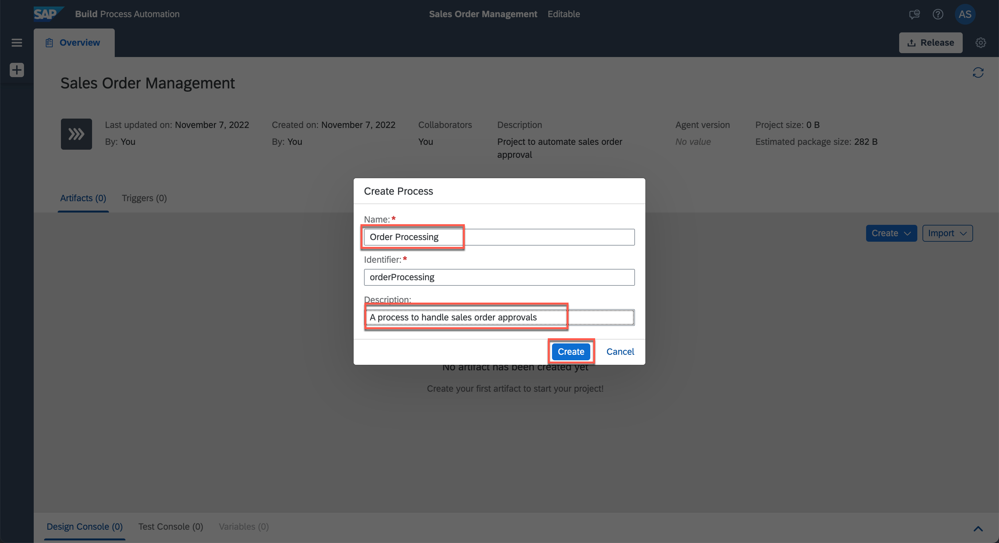
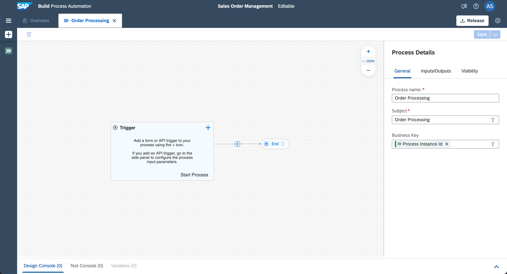

## Table of Contents
 - [Overview](#overview)
 - [Create Business Process Project](#createproject)
 - [Create Business Process](#createprocess)
 - [Summary](#summary)

## Overview 
With the new citizen automation user experience, you will get access to a new scope of opportunities for running your day-to-day workflows. In this tutorial, you will learn how a low-code and no-code tool can help you build the apps you need at the speed your business demands, using visual drag and drop tools for application development.

There are many use cases where you can make a difference using SAP Process Automation. During this tutorial, you will see how the Sales Order Approval process can be built using forms where a sales order is a document which confirms a sale that is generated by the seller after receiving a purchase order from the buyer. These sale order requests have to be reviewed and approved by the supplier to ensure that the sales orders are delivered on time. Once approved or rejected, the requester will be notified.

## Create Business Process Project 

1. In the **Lobby**, choose **Create**.

    > The lobby is a central page for creating, accessing, and managing your projects in SAP Process Automation. You can access business application processes, company configured templates, and other resources for your end-to-end business process.

    

2. In the popup, click **Build an Automated Process** and then select **Business Process**.

    > Business Process Projects are a collection of skills in SAP Process Automation. Projects are part of the internal business processes of a company and are defined based on business scenarios. A project can contain a set of processes, forms, automations and decisions, which are reusable artifacts.

    

3. In the **Create Business Process Project** dialog box, enter the following values to respective fields:

    | Field    | Value|
    | :------------- | :------------- |
    | Project Name      | Sales Orders Management      |
    | Short Description | Project to automate sales order approval |

    

    > Once the project is created successfully, a new editor will open to add the process to the newly created project.

## Create Business Process 

3. In the **Create Process** dialog box

    - Enter the following field values:

    | Field    | Value|
    | :------------- | :------------- |
    | Name      | Order Processing      |
    | Description | A process to handle sales order approvals |

    - Choose **Create**.

    > The process **Identifier** field is auto-filled.

    

4. Once the process is created, the process builder will open automatically and you can start modelling the process.

    

## Summary 

Now, that you have created the business process, it time to design the process with different activities like forms, decisions, automation etc.

Continue to - [Exercise 1.2 - Create and Configure Forms](https://developers.sap.com/tutorials/spa-create-forms.html)
