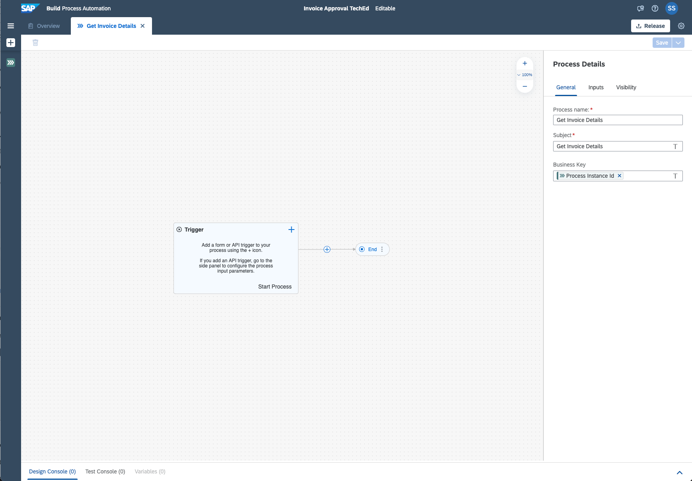

## Table of Contents
 - [Overview](#overview)
 - [Create a Business Process Project](#createproject)
 - [Create a Business Process](#createprocess)
 - [Define the Form to Start the Process](#defineform)
 - [Summary](#summary)

## Overview 
With the new citizen developer user experience, you will get access to a new scope of opportunities for running your day-to-day workflows. In this tutorial, you will learn how a low-code and no-code tool can help you build the apps you need at the speed your business demands, using visual drag and drop tools for application development.

Let's start with the creation of business process project and a form to trigger the process.

## Create a Business Process Project 

1. In the **Lobby**, choose **Create**.

    > The lobby is a central page for creating, accessing, and managing your projects in SAP Build Process Automation. You can access business application processes, company configured templates, and other resources for your end-to-end business process.

    

2. In the popup, click **Build an Automated Process** and then select **Business Process**.

    > Business Process Projects are a collection of skills in SAP Build Process Automation. Projects are part of the internal business processes of a company and are defined based on business scenarios. A project can contain a set of processes, forms, automations and decisions, which are reusable artifacts.

    

3. In the **Create Business Process Project** dialog box, enter the following values to respective fields:

    | Field    | Value|
    | :------------- | :------------- |
    | Project Name      | Invoice Approval      |
    | Short Description | Process to extract information from an invoice and get the needed approvals. |

    

    > Once the project is created successfully, a new editor will open to add the process to the newly created project.

## Create a Business Process 

1. In the **Create Process** dialog box

    - Enter the following field values:

    | Field    | Value|
    | :------------- | :------------- |
    | Name      | Get Invoice Details      |
    | Description | Process to approve invoices |

    - Choose **Create**.

    > The process **Identifier** field is auto-filled.

    

2. Once the process is created, the process builder will open automatically and you can start modelling the process.

    

## Define the Form to Start the Process 

To trigger the process you will create a form to provide the most relevant inputs.

1. In the canvas, select the the **Trigger** and click **+**, the select **Forms > New Forms**.

   
   
2. In the **Create Form** window enter:
   - Name: **Invoice Request Form**
   - Description: **Form to start the process** 
    
   > The identifier will be filled automatically.
   
   
   
3. Open the form editor.

   
   
4. In the form you have multiple layout and input elements.

   

   To add layout and inputs, drag and drop them or click on the element to include them in the form.
   
5. Add Layout elements:

    | Layout Type    | Name|
    | :------------- | :------------- |
    | Headline 1      | Invoice Request Form      |
    | Paragraph | Please provide the following details to start the process: |
   
   
  
6. Add Input elements:

    | Input Field Type    | Name | Settings |
    | :------------- | :------------- | :------------ |
    | Text      | Employee Name   | Required |
    | Text      | File Path   | Required |
    | Date      | Current Date | Required |
    
    > Required checkbox indicates, that it is a mandatory field.
    
    
    
7. **Save** the form.

       

## Summary 

Now, that you have created the business process and the first form, it is time to create the automation.

Continue to - 2. [Create an automation to extract Invoice Details](https://developers.sap.com/tutorials/spa-dox-create-automation.html)
